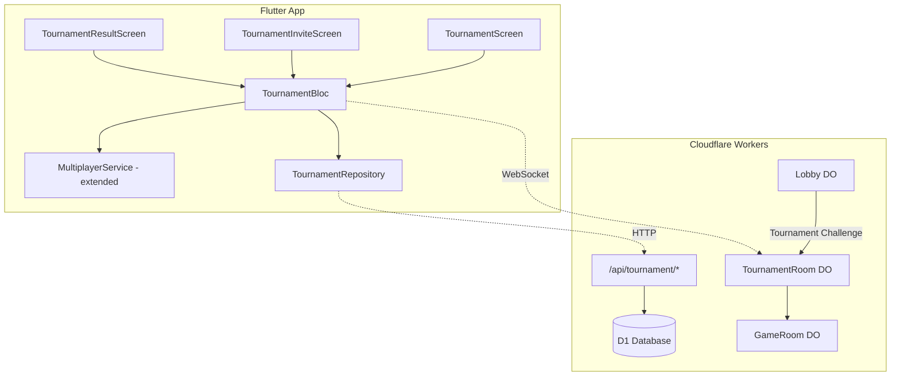

# Advanced Tournament System — Implementation Plan

Build a full-featured tournament engine with **public tournaments**, **private 1v1 invite-based tournaments**, dynamic round formats, ELO/XP tracking, and real-time engagement features — all integrated into the existing Chess Master platform.

## User Review Required

> [!IMPORTANT]
> **Database Migration**: This plan adds new columns to existing tables (`tournaments`, `tournament_participants`) and creates one new table (`tournament_matches`). A D1 migration SQL file will be created — you'll need to run it against the production database after deployment.

> [!WARNING]
> **Durable Object Addition**: A new `TournamentRoom` Durable Object will be added for real-time tournament orchestration. This requires a new migration tag in `wrangler.toml` and redeployment.

> [!IMPORTANT]
> **Lobby Challenge Integration**: The existing "Create Private Game" button (currently showing "coming soon!") will be replaced with the tournament invite flow. The `CHALLENGE` system in the lobby will be extended to include `tournament` mode challenges.

---

## Architecture Overview



---

## Proposed Changes

### Backend — Database Schema

#### [NEW] [migration_v11_tournaments.sql](file:///d:/PP942920DRIVE/PROJECTS/chess/backend/schema/migration_v11_tournaments.sql)

New migration to extend tournament infrastructure:

```sql
-- Add new columns to tournaments table
ALTER TABLE tournaments ADD COLUMN type TEXT NOT NULL DEFAULT 'public' 
  CHECK(type IN ('public','private'));
ALTER TABLE tournaments ADD COLUMN total_rounds INTEGER NOT NULL DEFAULT 3;
ALTER TABLE tournaments ADD COLUMN current_round INTEGER NOT NULL DEFAULT 0;

-- Track individual match results within a tournament
CREATE TABLE IF NOT EXISTS tournament_matches (
  id            INTEGER PRIMARY KEY AUTOINCREMENT,
  tournament_id TEXT NOT NULL REFERENCES tournaments(id) ON DELETE CASCADE,
  round_number  INTEGER NOT NULL,
  game_id       TEXT REFERENCES games(id),
  player1_id    TEXT NOT NULL REFERENCES users(id),
  player2_id    TEXT NOT NULL REFERENCES users(id),
  winner_id     TEXT REFERENCES users(id),
  result        TEXT CHECK(result IN ('player1','player2','draw')),
  status        TEXT NOT NULL DEFAULT 'pending' CHECK(status IN ('pending','active','completed')),
  white_id      TEXT REFERENCES users(id),
  black_id      TEXT REFERENCES users(id),
  created_at    TEXT NOT NULL DEFAULT (datetime('now'))
);

CREATE INDEX idx_tournament_matches_tid ON tournament_matches(tournament_id, round_number);
```

---

### Backend — Real-Time Tournament Orchestration

#### [NEW] [tournament_room.ts](file:///d:/PP942920DRIVE/PROJECTS/chess/backend/src/tournament_room.ts)

A new **Durable Object** (`TournamentRoom`) that manages the lifecycle of a single tournament:

- **State**: players map, scores, currentRound, totalRounds, status, timeControl, type
- **WebSocket events** (sent to connected tournament clients):
  - `tournament_start` — triggers when all players are ready
  - `round_start` — announces new round with pairing info
  - `match_result` — updates after each game completes
  - `standings_update` — sends current leaderboard data
  - `engagement_notice` — "Match point!", "Final round", "You lead 2–1"
  - `tournament_end` — final results with XP and ELO changes
- **Pairing logic**:
  - Private 2P: Direct pairing, alternate colors each round
  - Public Swiss: Sort by score, pair adjacent players, avoid repeat pairings
- **End condition**:
  - Private 2P: `playerWins > totalRounds / 2` (best-of-N)
  - Public: All rounds completed
- **Color alternation**: Tracks color history per pair, alternates white/black
- **GameRoom integration**: Creates a GameRoom DO per match, receives result callbacks

#### [MODIFY] [index.ts](file:///d:/PP942920DRIVE/PROJECTS/chess/backend/src/index.ts)

- Export new `TournamentRoom` DO
- Add WebSocket route: `GET /multiplayer/tournament/:tournamentId`

#### [MODIFY] [wrangler.toml](file:///d:/PP942920DRIVE/PROJECTS/chess/backend/wrangler.toml)

- New DO binding: `TOURNAMENT_ROOM` → `TournamentRoom`
- New migration tag `v3` for `TournamentRoom`
- Add `TOURNAMENT_ROOM` to Env interface

---

### Backend — REST API Enhancements

#### [MODIFY] [tournament.ts](file:///d:/PP942920DRIVE/PROJECTS/chess/backend/src/routes/tournament.ts)

Expand the existing tournament route to support:

| Endpoint | Method | Description |
|---|---|---|
| `POST /` | Enhanced | Accept `type`, `totalRounds`, `invited_players[]` |
| `POST /:id/start` | New | Start the tournament (auto-pair first round) |
| `POST /:id/result` | New | Report match result (called by GameRoom) |
| `GET /:id/standings` | New | Get current standings with scores |
| `POST /:id/invite` | New | Invite a player to a private tournament |
| `POST /:id/accept-invite` | New | Accept tournament invitation |

#### [MODIFY] [game.ts](file:///d:/PP942920DRIVE/PROJECTS/chess/backend/src/routes/game.ts)

- Apply tournament XP/ELO rules when `game.mode === 'tournament'`
- Use user's specified values: Win=+100XP, Draw=+30XP, Loss=-20XP, Undo=-25XP
- Apply streak multiplier: `xp = baseXP * (1 + streak * 0.2)`
- ELO changes: Win=+20, Loss=-15, Draw=±5

---

### Backend — Lobby Integration

#### [MODIFY] [lobby.ts](file:///d:/PP942920DRIVE/PROJECTS/chess/backend/src/lobby.ts)

Add `TOURNAMENT_CHALLENGE` message type:
- When a player sends a tournament invite from the lobby, forward to the challenged player
- On acceptance, create the tournament via REST API and redirect both players to the TournamentRoom WebSocket

---

### Flutter — Data Layer

#### [NEW] [tournament_model.dart](file:///d:/PP942920DRIVE/PROJECTS/chess/app/lib/data/models/tournament_model.dart)

```dart
class TournamentModel {
  final String id;
  final String name;
  final String type;        // 'public' | 'private'
  final String format;      // 'swiss' | 'best_of'
  final String status;
  final int totalRounds;
  final int currentRound;
  final String timeControl;
  final List<TournamentPlayer> players;
  final List<TournamentMatch> matches;
}

class TournamentPlayer {
  final String userId, username;
  final int rating, xp;
  final double points;
  final int wins, losses, draws;
}

class TournamentMatch {
  final int roundNumber;
  final String player1Id, player2Id;
  final String? winnerId, gameId;
  final String status;
}
```

#### [NEW] [tournament_repository.dart](file:///d:/PP942920DRIVE/PROJECTS/chess/app/lib/data/repositories/tournament_repository.dart)

HTTP client for all tournament REST endpoints using existing `Dio` instance:
- `fetchTournaments()`, `fetchTournament(id)`, `createTournament(...)`, `joinTournament(id)`, `getStandings(id)`

#### [MODIFY] [multiplayer_service.dart](file:///d:/PP942920DRIVE/PROJECTS/chess/app/lib/data/services/multiplayer_service.dart)

Add tournament-specific WebSocket connection methods:
- `connectTournament(tournamentId, userId, username)` — connects to TournamentRoom DO
- `Stream<Map> get tournamentUpdates` — tournament event stream
- `sendTournamentReady()`, `disconnectTournament()`

---

### Flutter — State Management

#### [NEW] [tournament_bloc.dart](file:///d:/PP942920DRIVE/PROJECTS/chess/app/lib/presentation/blocs/tournament/tournament_bloc.dart)

Dedicated BLoC for tournament lifecycle:

**Events**: `LoadTournaments`, `CreateTournament`, `JoinTournament`, `TournamentStarted`, `RoundStarted`, `MatchResultReceived`, `StandingsUpdated`, `EngagementNotice`, `TournamentEnded`, `SelectRounds`, `SelectTimeControl`

**State fields**: `tournaments[]`, `activeTournament`, `currentRound`, `myScore`, `opponentScore`, `standings[]`, `engagementMessage`, `xpEarned`, `eloChange`, `tournamentStatus`

#### [MODIFY] [multiplayer_bloc.dart](file:///d:/PP942920DRIVE/PROJECTS/chess/app/lib/presentation/blocs/multiplayer/multiplayer_bloc.dart)

- Add `MpSendTournamentInviteEvent` — sends challenge with `mode: 'tournament'` plus round/time settings
- Handle `TOURNAMENT_CHALLENGE_RECEIVED` lobby message

---

### Flutter — UI Screens

#### [NEW] [tournament_invite_screen.dart](file:///d:/PP942920DRIVE/PROJECTS/chess/app/lib/presentation/screens/tournament/tournament_invite_screen.dart)

Private tournament creation screen:
- **Player selector**: Shows online players from lobby (reuses `OnlineLobbyUser` list)
- **Round selector**: Choose 3, 5, or 7 rounds (visually styled chip selection)
- **Time control selector**: Reuses existing time grid from lobby
- **Send Invite button**: Creates tournament + sends WebSocket challenge
- Premium dark design matching existing `AppTheme`

#### [NEW] [tournament_lobby_screen.dart](file:///d:/PP942920DRIVE/PROJECTS/chess/app/lib/presentation/screens/tournament/tournament_lobby_screen.dart)

Tournament waiting/active screen:
- Shows current round number, total rounds
- Live scorecard (player vs opponent)
- Match status (waiting, playing, completed)
- Engagement banners: "Match point!", "Final round!", "You lead 2–1"
- List of completed round results
- Animated transitions between rounds

#### [NEW] [tournament_result_screen.dart](file:///d:/PP942920DRIVE/PROJECTS/chess/app/lib/presentation/screens/tournament/tournament_result_screen.dart)

Post-tournament results:
- Winner announcement with celebration animation
- XP earned (with streak multiplier breakdown)
- ELO rating change
- Round-by-round results recap
- "Play Again" / "Back to Lobby" buttons

#### [MODIFY] [game_room_screen.dart](file:///d:/PP942920DRIVE/PROJECTS/chess/app/lib/presentation/screens/multiplayer/game_room_screen.dart)

When `mode == tournament`:
- Enable: Undo button, floating chat bubble, brain explainer
- Disable: Coach, Hint
- Show tournament context bar (round X of Y, score)
- On game over → report result to TournamentBloc → navigate to next round or result

#### [MODIFY] [lobby_screen.dart](file:///d:/PP942920DRIVE/PROJECTS/chess/app/lib/presentation/screens/multiplayer/lobby_screen.dart)

- Replace "Private rooms coming soon!" with working tournament invite navigation
- Handle incoming tournament invite dialogs
- Add "🏆 Tournament" chip in player challenge options

---

### Flutter — Routing & DI

#### [MODIFY] [app_router.dart](file:///d:/PP942920DRIVE/PROJECTS/chess/app/lib/core/router/app_router.dart)

Add routes:
- `/tournament/invite` → TournamentInviteScreen
- `/tournament/:id` → TournamentLobbyScreen
- `/tournament/:id/result` → TournamentResultScreen

#### [MODIFY] [injection_container.dart](file:///d:/PP942920DRIVE/PROJECTS/chess/app/lib/core/di/injection_container.dart)

Register:
- `TournamentRepository` (lazy singleton)
- `TournamentBloc` (lazy singleton)

---

## ELO & XP Integration

| Event | XP Change | ELO Change |
|---|---|---|
| Win | +100 × (1 + streak × 0.2) | +20 |
| Draw | +30 × (1 + streak × 0.2) | +5 |
| Loss | -20 | -15 |
| Undo used | -25 | — |
| Tournament Win (overall) | +200 bonus | — |

The XP streak multiplier resets on loss. Undo penalty applies within 5 seconds of opponent's move as per existing rules.

---

## Gameboard Configuration (Tournament Mode)

| Feature | Status |
|---|---|
| Undo | ✅ Enabled (with -25 XP penalty) |
| Floating Chat Bubble | ✅ Enabled |
| Brain Explainer | ✅ Enabled |
| Coach | ❌ Disabled |
| Hint | ❌ Disabled |

---

## Open Questions

> [!IMPORTANT]
> **Public Tournament UI Entry**: Where should users discover/join public tournaments? Options:
> 1. A "Tournaments" tab on the home screen
> 2. A section within the lobby screen
> 3. A dedicated nav bar item
> 
> **Current plan**: Add a "🏆 Tournaments" card on the lobby screen that lists public tournaments, plus the invite flow for private ones.

> [!IMPORTANT]
> **Tournament Disconnect Handling**: Current spec says "disconnect → loss after timeout". Should we use the existing 30-second timeout from `GameRoom`, or a different tournament-specific timeout?
> 
> **Current plan**: Use the same 30-second timeout — the GameRoom already handles this, and the result propagates to the tournament.

---

## Verification Plan

### Automated Tests
- `flutter analyze` — ensure no analysis errors
- `flutter build web` — verify successful web build

### Manual Verification
- Create a private tournament invite from lobby → opponent receives it → accept → tournament starts
- Play through a 3-round best-of tournament, verify round transitions
- Verify XP and ELO changes are applied correctly after tournament ends
- Verify engagement messages appear at correct moments
- Verify disconnect handling during a tournament match
- Test public tournament join/leave flow
