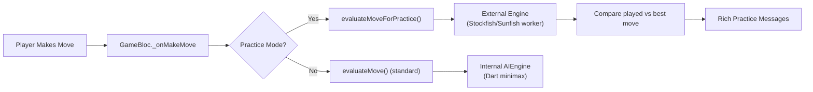

# 🎯 Practice Mode — Enhanced Coaching System

## Changes Made

### 1. Unlimited Undo & Hints  
**Files**: [game_bloc.dart](file:///d:/PP942920DRIVE/PROJECTS/chess/app/lib/presentation/blocs/game/game_bloc.dart), [game_screen.dart](file:///d:/PP942920DRIVE/PROJECTS/chess/app/lib/presentation/screens/game/game_screen.dart)

- **Undo**: Already free (no XP cost) — now UI shows `Undo ∞` label
- **Hints**: All 3 levels now free (L1 was already free, L2/L3 upgrade XP cost set to 0 in practice)
- **Hint label**: Shows `Hint ∞` in practice mode

### 2. Suppressed "Thinking" Messages  
**Files**: [game_screen.dart](file:///d:/PP942920DRIVE/PROJECTS/chess/app/lib/presentation/screens/game/game_screen.dart), [reacting_robot_widget.dart](file:///d:/PP942920DRIVE/PROJECTS/chess/app/lib/presentation/widgets/reacting_robot_widget.dart)

- Coach widget **does not appear** during AI thinking in Practice Mode
- Robot mood **skips** `RobotMood.thinking` in Practice Mode
- No thinking dots, no "Calculating possibilities..." filler messages
- ✅ Reactions, hints, and coaching feedback still display normally

### 3. Deep Engine-Based Coaching (New!) 🧠
**Files**: [coach_controller.dart](file:///d:/PP942920DRIVE/PROJECTS/chess/app/lib/domain/engine/coach_controller.dart), [game_bloc.dart](file:///d:/PP942920DRIVE/PROJECTS/chess/app/lib/presentation/blocs/game/game_bloc.dart)

#### Architecture

#### How It Works

1. **Best move reference**: Uses the **active external engine** (Stockfish or Sunfish worker — whichever is running) via `AIEngineController.analyzeMoveBackground(fen)` for the most accurate analysis
2. **Centipawn loss calculation**: Compares the engine's best move score against the played move's score
3. **Classification**: Same thresholds as standard mode (`<20cp` = best, `<50cp` = good, `<100cp` = inaccuracy, `<500cp` = mistake, `>500cp` = blunder)
4. **Fallback**: If the external engine is unavailable, falls back to the internal `AIEngine` (Dart-side minimax)

#### Message Tiers (40+ unique messages)

| Tier | Classification | Example Messages |
|------|---------------|-----------------|
| 🏆 **Best** | best, brilliant | "You're on the correct path! Keep it up! 🎯✨", "Now you play like a real chess master! 👑🔥" |
| 👍 **Good** | good | "Solid move! You're building a strong position 👍", "Good thinking! That keeps the pressure on 🔥" |
| 🤔 **Medium** | needsImprovement | "You can think of an alternative move here 🤔", "I may suggest you explore other options 💡" |
| ⚠️ **Mistake** | mistake | "Oops! That move isn't the strongest here. Let me help 🤝", "Careful! There was a stronger option 🔑" |
| ❌ **Blunder** | blunder | "Oh no! That's a serious mistake! Let me show you why ❌🔥", "Remember: checks, captures, threats! 🎓" |

Each tier also has detailed **explanations** that reference the actual best move (`e2e4`), target square, pattern detected, and teaching tips.

> [!TIP]
> The Practice Mode analysis uses the same engine that plays the AI moves — so if Stockfish is running, the coaching reference is Stockfish-caliber. If only Sunfish is available, it uses that. This ensures maximum accuracy with whatever is available.
