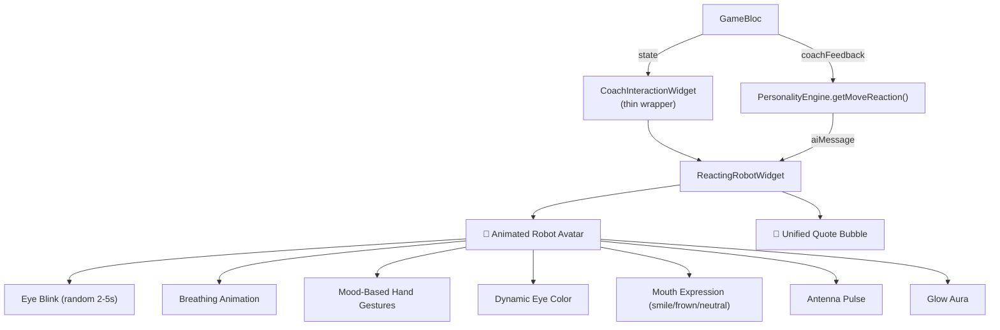

# 🤖 ReactingRobotWidget — Unified AI Coach Component

## What Changed

### New Files
- [reacting_robot_widget.dart](file:///d:/PP942920DRIVE/PROJECTS/chess/app/lib/presentation/widgets/reacting_robot_widget.dart) — **The unified component** (770+ lines)

### Modified Files
- [coach_interaction_widget.dart](file:///d:/PP942920DRIVE/PROJECTS/chess/app/lib/presentation/widgets/coach_interaction_widget.dart) — Simplified to a thin wrapper  
- [personality_engine.dart](file:///d:/PP942920DRIVE/PROJECTS/chess/app/lib/domain/engine/personality_engine.dart) — Added `getMoveReaction()` with 90+ personality-flavored reactions  
- [game_bloc.dart](file:///d:/PP942920DRIVE/PROJECTS/chess/app/lib/presentation/blocs/game/game_bloc.dart) — Coach feedback now emits personality-driven reaction messages

---

## Architecture



---

## 8 Robot Moods

| Mood | Eye Color | Hand Animation | Mouth | Trigger |
|------|-----------|----------------|-------|---------|
| **Idle** | Sky Blue | Gentle sway | Neutral | Player's turn |
| **Thinking** | Cyan | Circular motion | Neutral | AI calculating |
| **Happy** | Green | Wave/cheer | 😊 Smile | Good/Best move |
| **Impressed** | Purple | Rapid excited wave | 😊 Smile | Brilliant move |
| **Worried** | Orange | Nervous fidget | 😟 Frown | Strong player move |
| **Disappointed** | Red | Droop down | 😟 Frown | Blunder |
| **Hinting** | Gold | Point outward | Neutral | Hint active |
| **Celebrating** | Gold Light | Wave/cheer | 😊 Smile | Game over |

---

## Personality × Move Reactions (90+ messages)

Each of the **6 personalities** (Aggressive, Defensive, Tricky, Lazy, Random, Coach) now has unique reactions for **5 move qualities** (Brilliant, Best, Good, Mistake, Blunder):

````carousel
### 😈 Aggressive
| Move | Example |
|------|---------|
| Brilliant | "Impossible! That was genius! 🤯🔥" |
| Blunder | "GOTCHA! Time to go in for the kill! 🦁🔥" |
<!-- slide -->
### 🏰 Defensive
| Move | Example |
|------|---------|
| Brilliant | "Amazing move! My walls are shaking! 🏰😰" |
| Blunder | "That... wasn't your best moment! 😬" |
<!-- slide -->
### 🃏 Tricky
| Move | Example |
|------|---------|
| Brilliant | "Whoa! You saw through my tricks! 🎩😮" |
| Blunder | "SURPRISE! You fell for it! 🎉🕸️" |
<!-- slide -->
### 🎓 Coach
| Move | Example |
|------|---------|
| Brilliant | "OUTSTANDING! That's a grandmaster-level move! 🏆🎓" |
| Blunder | "Careful! Look for checks and captures first! 🎓" |
````

---

## Key Design Decisions

> [!IMPORTANT]
> The old `AnimatedRobotCoach` and `ThinkingOverlay` are **not deleted** — they're simply no longer used by the coach interaction path. The `CoachInteractionWidget` now delegates entirely to `ReactingRobotWidget`.

> [!TIP]
> The widget reacts **immediately** to player moves via `didUpdateWidget` — no delay. It reads `coachFeedback` from `GameState` and maps the classification to a mood + personality reaction in a single frame.

> [!NOTE]
> The 4 independent animation controllers (blink, breath, hand, pulse) run continuously and respond to mood changes without restart, creating a smooth "alive" feel.
